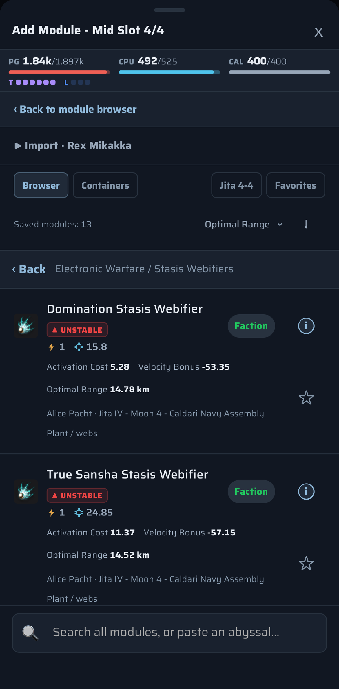
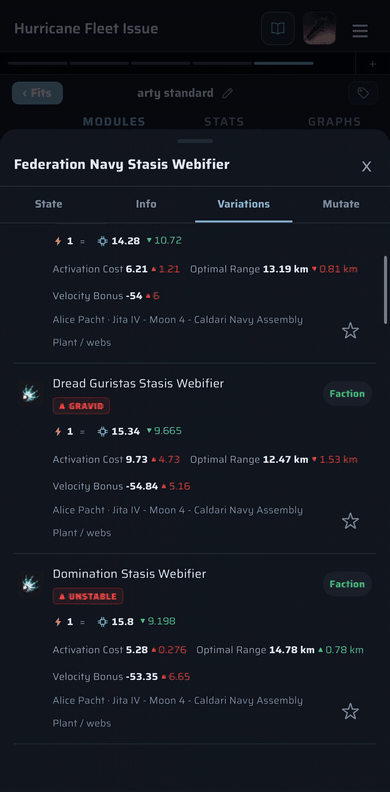
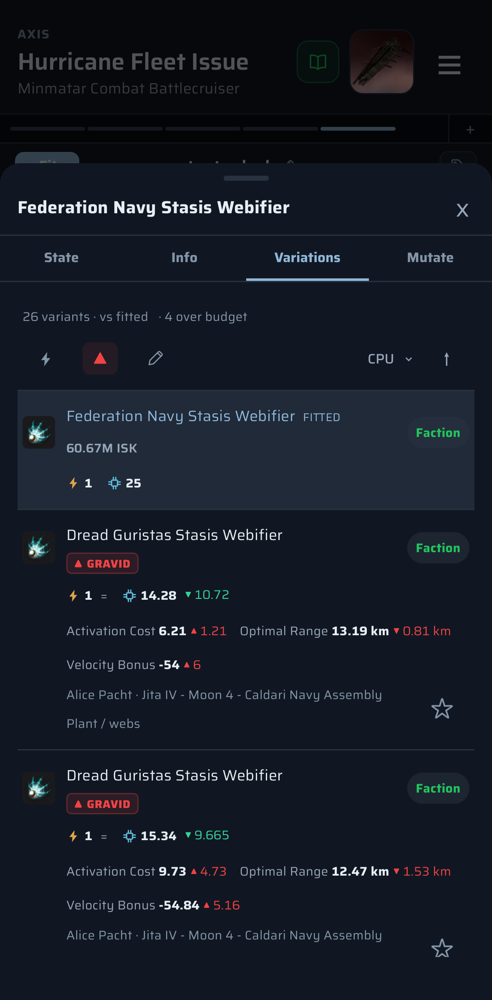
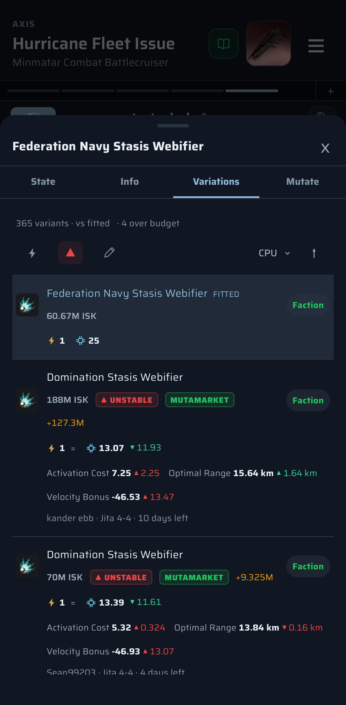
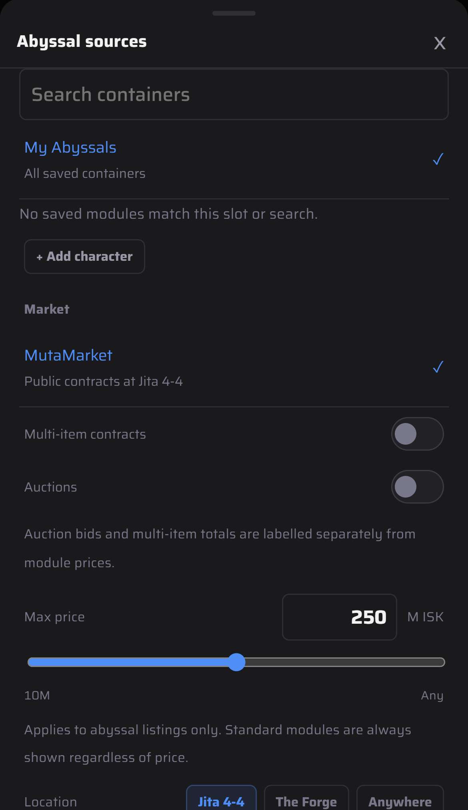
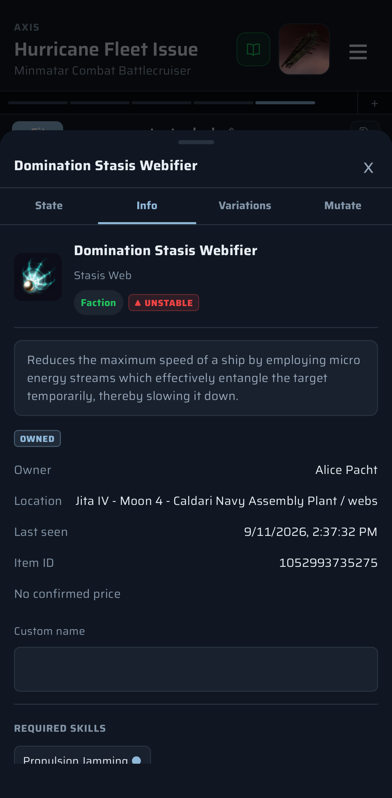

# Abyssal modules

Import your own rolls, find more on MutaMarket, and fit the exact module you have or want, with every rolled stat compared against what's fitted.

1. **Import your collection.** When adding a module, open **My Abyssals** in the module browser. Under **Import**, connect a character with asset access, **Scan character assets**, pick the locations to import and tap **Import selected locations**. It only reads your assets and can't move anything.
2. **Browse what you own.** **Browser** files your rolls under the market tree, and **Containers** under where they sit. **Jita 4-4** and **Favorites** filter the list, and the sort menu ranks by any rolled stat (or a rate like Repair Rate for repairers). Tap ⓘ for a roll's details, or ☆ to favourite it.
3. **Compare against the fit.** Open a fitted module's **Variations** tab. Your rolls and MutaMarket listings appear next to the standard variants, each showing its difference from the fitted module. Listings show price, seller, location and time left.
4. **Choose where rolls come from.** The pencil on Variations opens **Abyssal sources**: My Abyssals or a single character or container, plus MutaMarket at Jita 4-4, The Forge or anywhere. You can also set a max price and choose whether to include auctions and multi-item contracts.
5. **Fit one.** Tap a roll in Variations and it replaces the fitted module.

The library, pick, owned-roll, MutaMarket and info images were taken on an iPhone.
