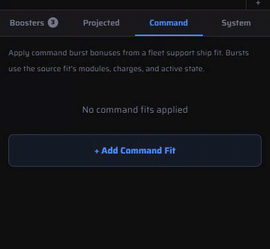
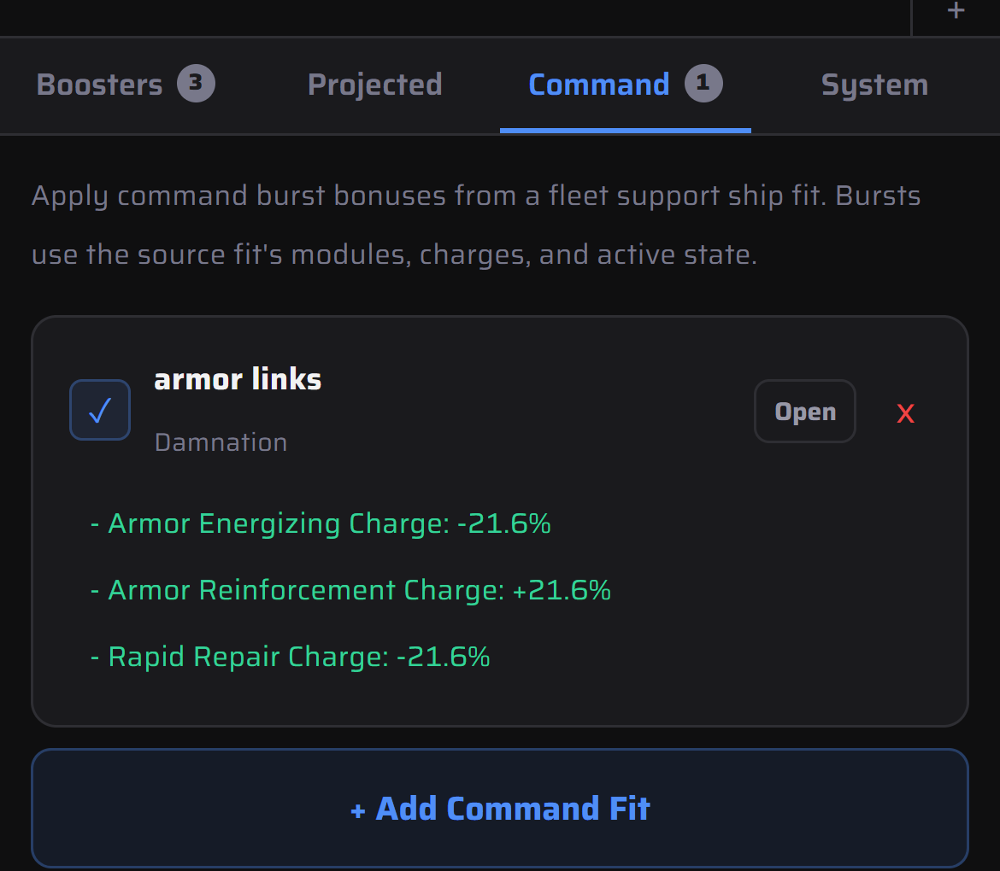

# Fleet boosts and other effects

The **Effects** tab applies what isn't on your own ship: boosters, other fits' command bursts, projected modules, and the system you're in.

1. Open **Effects** in the bottom bar.
2. **Command:** tap **+ Add Command Fit** and pick a saved fit with command bursts. Its bursts, charges and active state are used as saved, and the strength of each burst is listed on the card.
3. Untick the card to turn its boosts off without removing it. **Open** opens the booster's own fit in a new tab.
4. **Projected** does the same for remote reps, webs, neuts, painters and other EWAR, with a range per source. **System** applies wormhole and other environment effects.
5. **Boosters** lists your drugs. Tap a side effect to simulate it.

With the armor-links Damnation below applied, this Hurricane Fleet Issue goes from 48.3k to 57.5k EHP, and its armor rep from 192 to 302 EHP/s.

 
