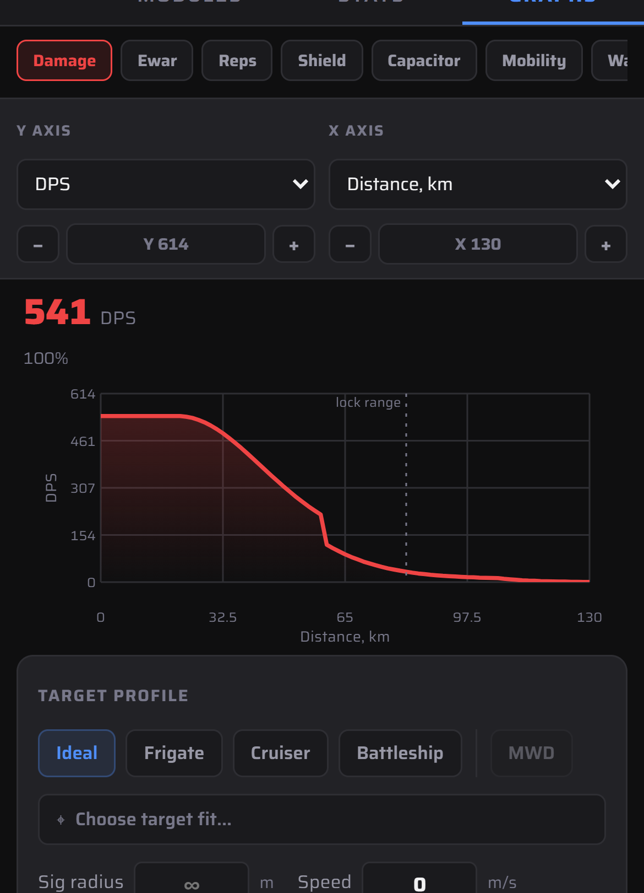
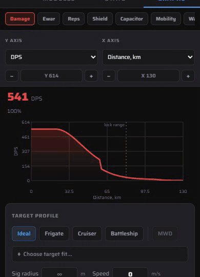

# Graphs

The Graphs tab plots one fit's performance against distance, time, target speed or signature, depending on the graph.

1. Pick a category: Damage, Ewar, Reps, Shield, Capacitor, Mobility, Warp or Lock. The chips scroll sideways.
2. Choose the **Y axis** and **X axis** from the dropdowns. Use **−** / **+** to rescale either axis.
3. Tap the chart to move the cursor. The big number is the reading there (`34.2 DPS @ 81.0`).
4. For damage, set the **Target profile**: Ideal, Frigate, Cruiser or Battleship, or **Choose target fit…** to shoot at one of your saved fits. Each preset fills in **Sig radius** and **Speed** (Frigate is 40 m at 350 m/s). **MWD** switches it to the MWD-blooming version (200 m at 3050 m/s).
5. **Adjust a number by dragging it.** Press on **Sig radius** or **Speed** (or the range and time-window fields some graphs show) and slide sideways to change it. The graph redraws as you go, so it plays out the target getting bigger or faster. A plain tap still lets you type a value.
6. **Flight vectors** sets how each ship is moving: drag a wheel to set its heading and speed. **Double-tap a wheel** to reset it to 0 (pointing along the line between the ships, standing still).

If the presets barely change the curve, check the flight vectors. By default the target flies straight along your line of sight (0 m/s transversal), so turret tracking doesn't come into it.

 
