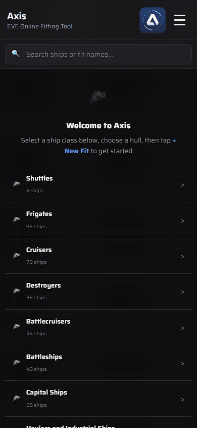
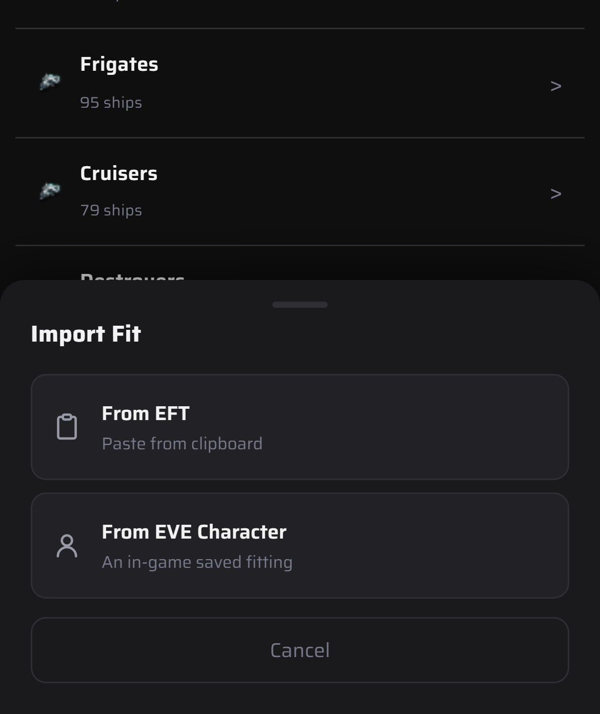

# Importing a fit

Copy a fit in EFT format (pyfa's **Copy to clipboard → EFT**, or the in-game fitting window's export) and bring it into Axis.

1. Copy the fit.
2. Open the **☰** menu and tap **Import Fit**.
3. Tap **From EFT**. Axis reads the clipboard and opens the fit, ready to edit.
4. **From EVE Character** pulls a saved fitting from a linked character instead.

Drones come in docked: tick them on the **Drones** tab to launch them. Charges, implants, boosters and cargo come along with the fit.

To import your whole pyfa library at once, see [Importing from pyfa](pyfa-import.md).
