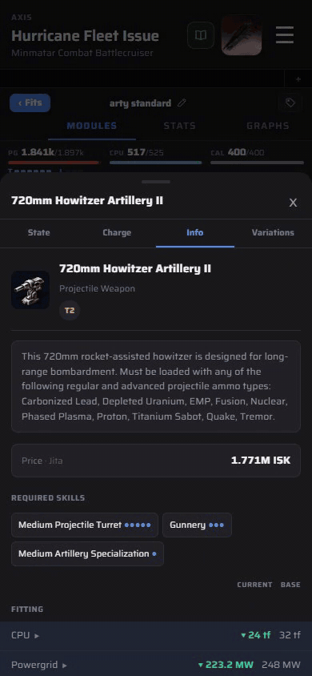
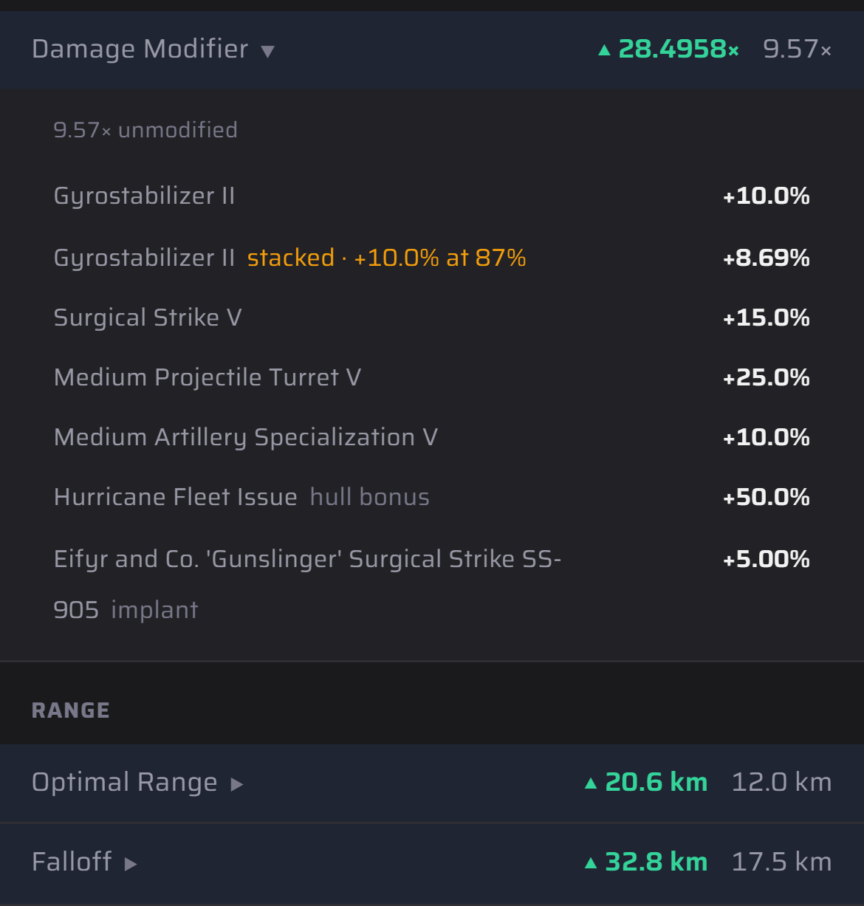

# Where a number comes from

Any modified attribute can be expanded to list every source that changed it. Use this to trace a number back to its sources.

1. Tap a module, then open the **Info** tab.
2. Attributes show **Current** next to **Base**. Rows with a ▶ have been modified.
3. Tap the row. It lists the unmodified value, then each skill, module, implant and hull bonus with its contribution.
4. Stacking penalties are shown as they apply: `stacked · +10.0% at 87%` means the second Gyrostabilizer gives 8.69% instead of 10%.

 
