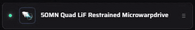
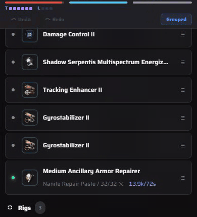

# Module states and gestures

The dot on the left of each module row sets its state: offline, online, active or overheated.

- **Tap** to switch between active and online.
- **Double-tap** to overheat (orange dot).
- **Hold** to take it offline (grey, dimmed row). Tapping an offline module brings it straight back to active.
- Tap the module's name for its sheet, where **State** has all four as buttons, alongside Charge, Info and Variations.

## Swipe to copy or remove

**Swipe a module row to the right** to reveal two buttons behind it.

- **Copy** (blue) puts another of the same module in the nearest empty slot of that rack. The tray stays open so you can keep tapping it, and it greys out when the rack is full.
- **Remove** (red) takes the module off and leaves the slot empty.
- Removed something by mistake? **Undo** sits under the fitting bars.

