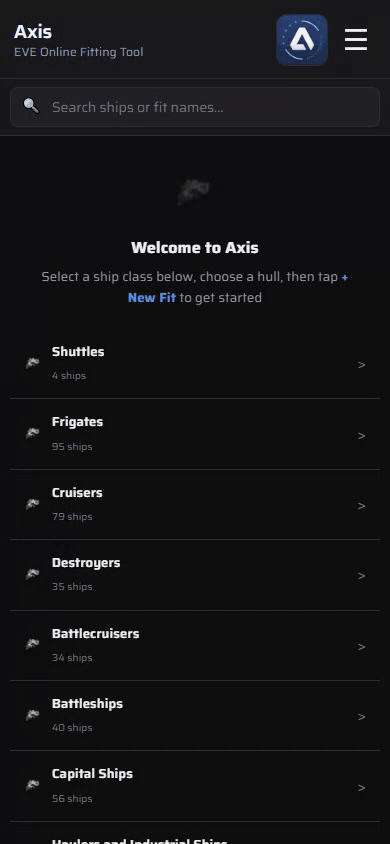
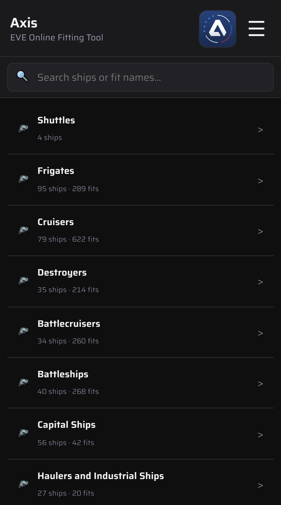
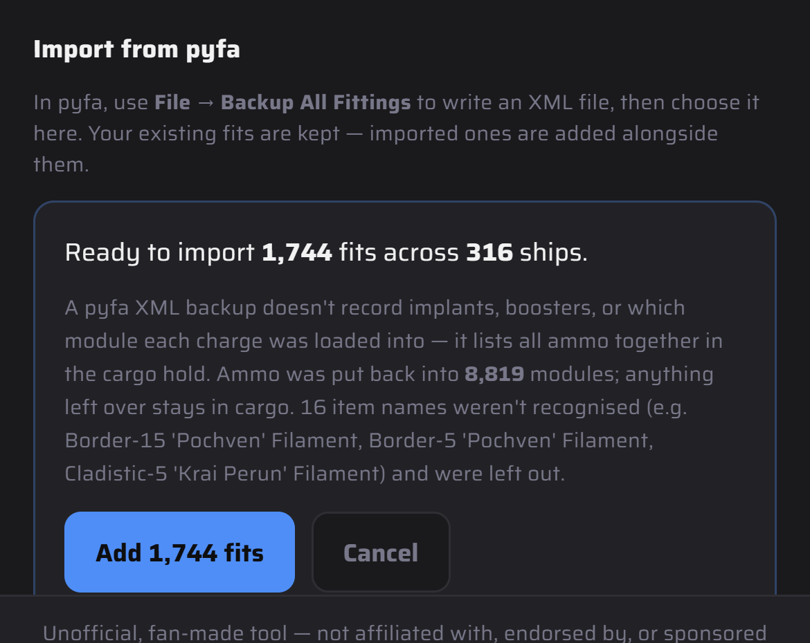

# Importing from pyfa

Bring your whole pyfa library into Axis in one go from pyfa's XML backup. It's one-way: nothing syncs back to pyfa.

1. In pyfa, **File → Backup All Fittings** writes an XML file. Get it onto your phone.
2. In Axis, open **☰ → Settings → Backup** and tap **Choose pyfa XML file…** under **Import from pyfa**.
3. Check the summary (fits, ships, anything it couldn't read), then tap **Add N fits**.
4. Your existing fits are kept. Imported ones are added alongside, and a name that's already taken gets a suffix like `(2)`. Importing the same file twice gives you two copies.
5. Changed your mind? **Undo pyfa import** on the same Backup tab puts the library back how it was.

pyfa's backup doesn't record implants, boosters, or which module each charge was in (all ammo goes in the hold). Axis loads each empty gun with ammo from the hold and tells you how many it filled. Items Axis doesn't recognise, such as filaments, are listed and left out.

 

