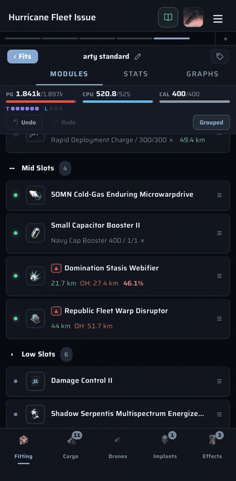
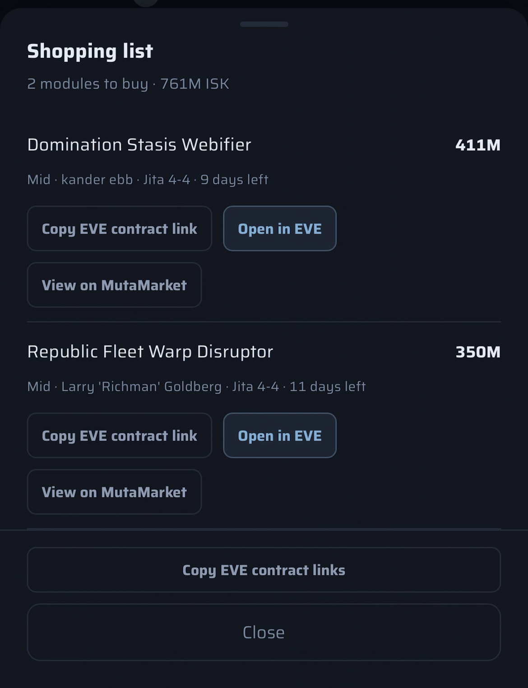

# Shopping list

When a fit uses abyssal modules picked from MutaMarket, the shopping list collects the contracts you need to buy and links each one.

1. Fit the modules from MutaMarket listings in **Variations** (see [Abyssal modules](abyssals.md)).
2. Open **☰ → Shopping List**. The header totals what's left to buy (`2 modules to buy · 761M ISK`).
3. Each module shows its price, slot, seller, location and days left on the contract.
4. **Copy EVE contract link** copies a link you can paste into EVE chat. **Copy EVE contract links** at the bottom copies all of them. No character is needed, but a link is only included when the contract's solar system is known.
5. **Open in EVE** opens the contract window in your running EVE client. It needs a linked character with contract access. **View on MutaMarket** opens the listing in your browser.

Rolls you already own show as **Already in your hangar**, and contracts that have ended are marked **Expired**, so the list never quietly drops a module.

Captured on an iPhone.
