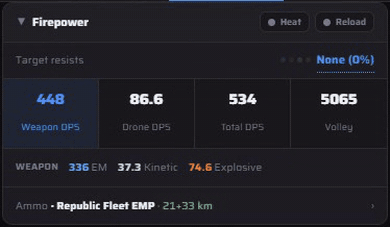
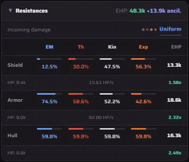
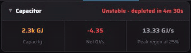

# Stats tab: tap the numbers

Most figures on the Stats tab switch to another view of the same number when you tap them.

- **Firepower:** tap Weapon, Drone, Total or Volley to show that figure's damage split by type on the row below. **Heat** overheats every gun, and **Reload** counts reload time in DPS. With rapid launchers, tapping Volley again switches to **Clip Dmg**, the damage one clip does before reloading.
- **Resistances:** tap the EHP total to see exact values instead of `48.3k`. If you've fitted an ancillary repairer, tap `+13.9k ancil.` to add its charges to the total, and tap again to show it separately.
- **Capacitor:** **Net GJ/s** switches to **In / Out GJ/s**, and **Peak regen** switches to **Neut resist**. Tap Capacity for the exact GJ.
- **Targeting and Misc:** tap any rounded value (mass, signature radius and so on) for the exact number.
- **Incoming damage** and **Target resists** open profile pickers. Tap a section header to collapse it.

