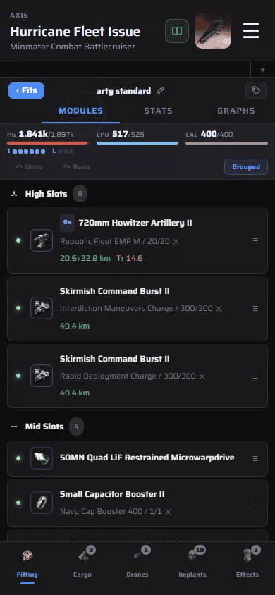
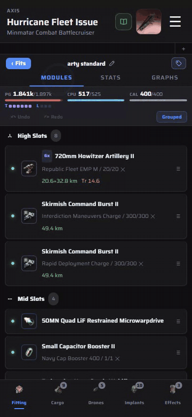

# Tags

Tags group fits across hulls (a doctrine, a playstyle, "needs work") so you can find them without knowing the ship.

1. With a fit open, tap the tag button at the top right of the fit header.
2. Type a name and tap **Create "…"**. Matching tags you already have are listed under **Add existing**, so tap one to reuse it. A new tag gets a colour automatically.
3. Tags show as chips on the fit's row. Tap **+ Tag** on any row in a fit list to tag it from there.
4. Once a tag exists, the home screen gets a **Tags** section with a chip per tag and a count. Tap one to list every fit with that tag, whatever the hull.
5. Renaming, recolouring and deleting a tag is done from that list, under **Edit**. Searching also matches tag names.

